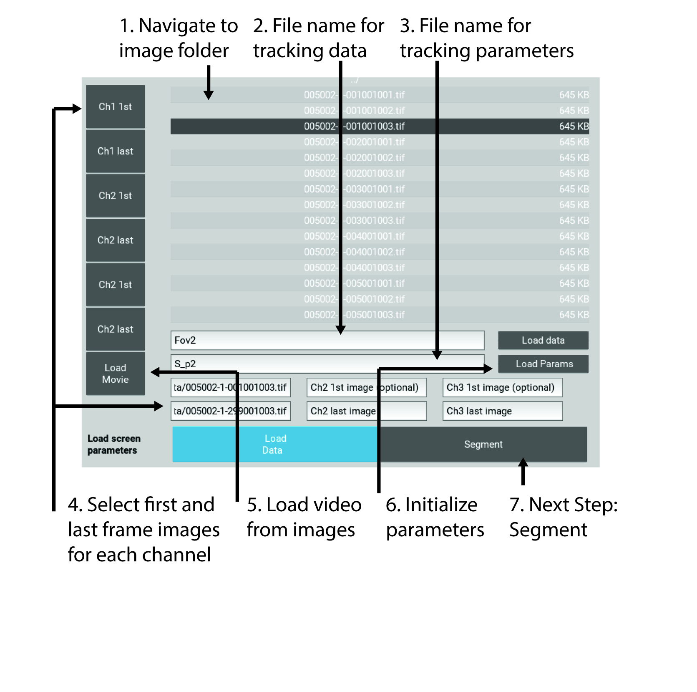
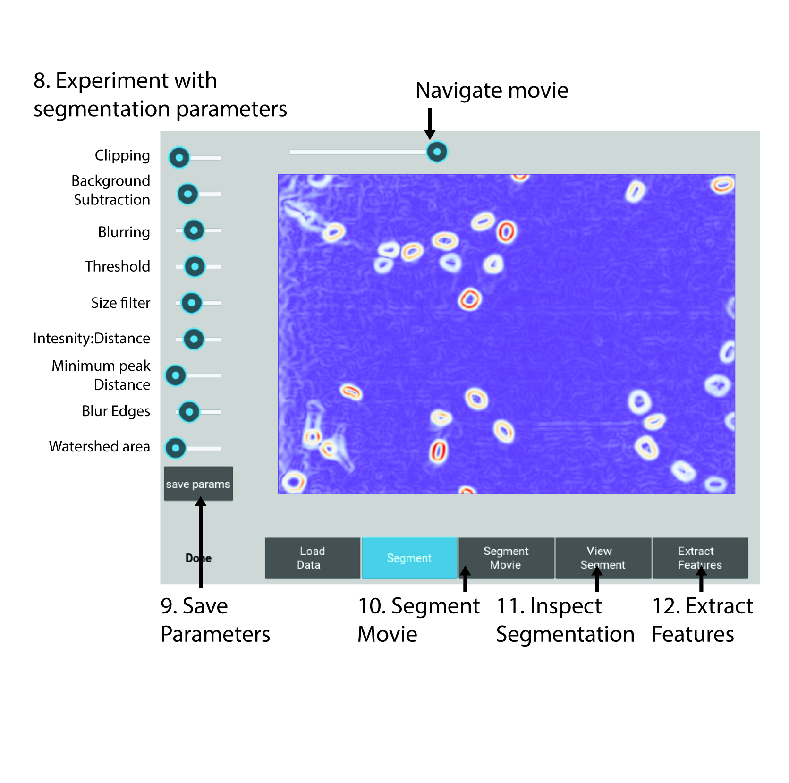
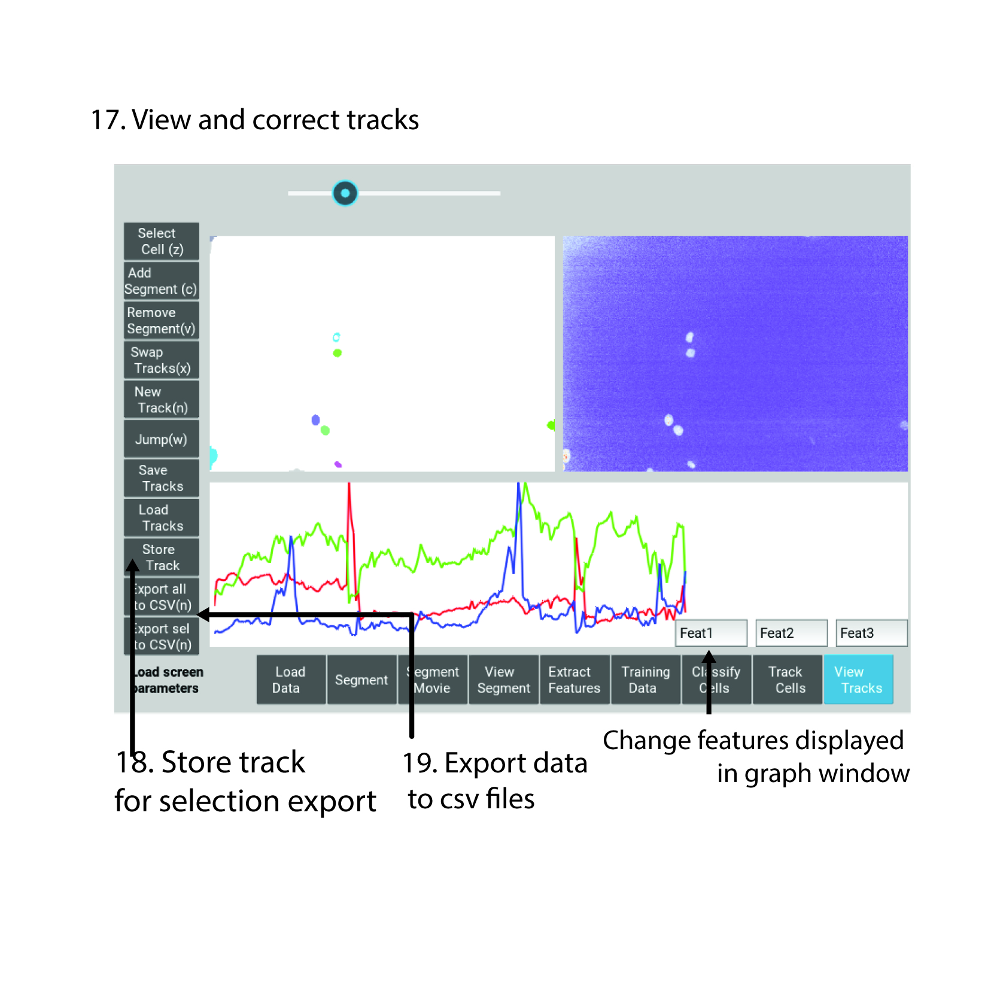

.. nuclitrack documentation master file, created by
   sphinx-quickstart on Fri Feb  3 11:42:43 2017.
   You can adapt this file completely to your liking, but it should at least
   contain the root `toctree` directive.

Getting started
===============

NucliTrack is designed as an easy to use Python 3 Application for tracking cell nuclei. We're glad you have chosen to try our software out, please follow the following steps to track your first video.

Installation
------------

To run NucliTrack you must have `Python3 <https://www.python.org/downloads/>`_ installed we recommend using the `Anaconda <https://www.continuum.io/downloads>`_ distribution for windows users.

Once you've got Python3 up and running you will need packages called Cython and numpy. This is easily installed using the pip installer, from the terminal (linux/mac users) or anaconda command prompt (windows) type:
.. code-block::
	> pip install cython
	> pip install numpy

Now you're ready to install NucliTrack:
.. code-block::
	> pip install nuclitrack

Notes:

 *If Python2 is installed on your system, you will probably need to specify the pip installer to use e.g. pip3.6, to ensure everything works properly.
 *Kivy may require the openGL dev library to install properly, e.g. yum install mesa-libGL on RHEL/Fedora linux

Launching NucliTrack
--------------------

To launch nuclitrack start Python3 up in your terminal
.. code-block::
	> Python3

Python should now be running. Import NucliTrack and this will load up the Pygame window:
.. code-block::
	>> import nuclitrack

Finally run the nuclitrack application
.. code-block::
	>> nuclitrack.CellTrackApp().run()

The application should be running now and you're ready to get going.
 

Loading time series images
--------------------------

To get started you need a video of cells that need tracking. Importantly, the video must be stored as a sequence of individual tiff files, it doesn't matter how they're named but somewhere they must have zero padded time points e.g:

|	somename_ch1_01.tif
|	somename_ch1_01.tif
|	somename_ch1_01.tif

	...

	somename_ch1_99.tif

Different channels can be loaded as long as the image size and number of frame is the same:

|	somename_ch2_01.tif
|	somename_ch2_01.tif
|	somename_ch2_01.tif

	...

	somename_ch2_99.tif

Finally the first and last time point must have different digits:

|	somename_ch1_01.tif
|	somename_ch1_39.tif

is ok but:

|	somename_ch1_01.tif
|	somename_ch1_21.tif

would not work properly. whilst you may end up missing one image, we feel this is a small price to pay for not having to faff around with complex naming conventions.

A good set of videos to try the application out is the `benchmark dataset <http://ctc2015.gryf.fi.muni.cz/Public/FirstEdition/>`_ from the `first cell tracking challenge <http://www.codesolorzano.com/celltrackingchallenge/Cell_Tracking_Challenge/Results_First_CTC.html>`_.

Select load data, and into the first box type a filename and press enter, this is where your tracking data will be saved. If you already have data in that file you can now load it by clicking load data.

To load your videos navigate to the folder containing them. Double click the first image in the sequence then click the 'CH1 1st' button, then double click the last image in the sequence and click 'CH last'.

You can now load the movie by clicking the load movie button. Alternatively, other channels can be loaded allowing data to be extracted from them, though only the first channel is used for segmentation. Finally if you have a file location copied to the clip board this can be pasted into the textboxes for file name and amended.

Note: pasting into the text box requires a double click as opposed to keyboard shortcut.

Finally choose a file name to store your parameters in hit enter, then click load data, this is separate to the tracking file so you can reuse parameters for future experiments.

Click load data button again to minimise this window.

   Step 1: File loading, image of the file loading GUI
   
Segmentation
------------

Now you're ready to segment your imaging series. Segmentation is based on a watershed procedure. All the steps except the last two are designed to identify the center of individual nuclei, in the last two steps the aim is to accurately mask every nuclei.

On the left hand side of the interface you should see a panel of sliders allowing you to segment the image. The best way to find out what they do is to play around, though a more detailed description for each control is below:

*    Clipping threshold: this sets the maximum intensity of the image, anything above this intensity is clipped to this intensity
*    Background Correction: background intensity variation is corrected by subtracting a really blurred version of the image from the original, this slider controls how blurred this image is.
*    Blurring: prior to thresholding pixel noise must be reduced this slider adjusts how blurred the image used for thresholding is.
*    Threshold level: the slider here controls what level of intensity should be used to define what are nuclei and what is background. Don't worry if nuclei are touching each other at this point.
*    Filter small objects: if there are lots of small objects that have been thresholded but aren't nuclei you can filter them out using this slider
*    Intensity or Distance: the next step is to identify local maximum within the thresholded regions, ideally local maximum will exist in the center of each nuclei, the maximum intensity often doesn't reflect the center of the nuclei or even worse may lead to multiple local maxima appearing in each cell. This function allows you to choose to what degree local maxima are defined by the intensity or distance from edge.
*    Peak local maxima: behind this slider is a function which identifies local intensity peaks in the image, the slider sets the minimum distance allowed between peaks.
*    Edge detection: this slider controls how blurry the image is prior to edges being marked, more blurry means edges are smoother though may match the shape less.
*    Watershed: behind this slider is the watershed function which calculates where the local basins of attraction are in the image, like marking valleys in a mountainous terrain. The selected peak local maxima represent the bottom of the valleys, by adjusting the slider the lowest area is made larger or smaller, this like mining into the side of mountains to force the valley to be larger.

Use the slider in the top left hand corner to navigate around the video and try out your segmentation parameters on other frames. Also other channel data can be visualised though these are not used for segmentation in the current edition.

Once you have achieved good segmentation it's now time to save the parameters. Once this is done, minimise the segmentaiton window and click segment movie to apply your segmentation parameters to the entire image sequence. This may take a while depending on how fast your computer is and how large you movie is.

When segmentation is done a button will appear allowing you to visualise the results of segmentation and decide whether you want to go back and adjust parameters or move forward. If you are happy go ahead and minimise the view segment window.

   Step 2: Choosing segmentation parameters, image of the segmentation GUI

Training Data
-------------

The algorithm that tracks yours cell is probabilistic. Meaning, it will assign a probability to every segment giving it a measure of whether it is likely to be a single nuclei, a mitotic nuclei, on that has left mitosis recently, or an erroneous segmentation either, more than one nuclei or no nuclei.

To calculate the probabilities features must be extracted from each segment. Click extract features to do this, again this step may take a few minutes.

Now select the training data button, you will be presented with a window showing your segmented cells in gray.

The buttons on the right allow you select training data for the probabilistic tracking algorithm. Click a button then select cells in the window to assign them as either 1 cell, a mitotic cell or a cell that has just left mitosis. You probably want to select around 10 to 20 examples of single cells, and then 3 or 4 mitotic cells and 5 or 6 cells that have left mitosis.

If allot of segmentation errors have been made consider selecting examples of these, but the algorithm usually works just fine without these examples.

Three new sliders also exist in the top left hand corner along with text, generally the default value swill work though you may want to adjust these if tracking is particularly slow:

* The furthest left of these sliders determines how far (in pixels) the algorithm will search in the previous frame, this should roughly correspond to the largest jump that nuclei are making between frames, however larger values will also mean tracking will take longer.
* The middle of the three sliders determines the largest gap between frames that can occur in a track. Smaller values speed up tracking whilst larger values take longer.
* The final slider changes the penalty for movement distance, smaller values mean less penalty than larger values. Reduce this if cells are moving allot whilst increase this value if cells make small movements.

Once everything is selected, click save training. A button for classifying cells will now appear. Click this to assign probabilities to every cell in the image sequence.

Everything is now ready for tracking, hit this button to begin tracking. A feed of cell scores will appear in the terminal after a short period of time, giving the total score of tracking. This will increase steadily as tracks are iteratively added.

.. figure:: Nt03.jpg
   :scale: 80 %
   :alt: Semgentation

   Step 3: Selecting training data, image of the training data selection GUI

Correcting and storing tracks
-----------------------------

With tracking complete you can now inspect the results of automated tracking by scrolling backwards and forwards through the video. For single frame movements you can also use the keyboard hotkeys (a) and (d).

To inspect data on a track click the select track button, or use the hotkey (z). Then select a labelled cell in the track segment window. Data on this track will now appear in the bottom window. You can jump from one frame to another in the movie, by clicking the jump button or pressing (w), then clicking on the graph. The tracking window will then jump to the frame as selected on the x axis.

Automated tracking is likely to make errors. Buttons on the left hand side let you correct these.

* To add a segment to a track, click add segment (c) then select a segment on the screen.
* To remove a segment click remove segment (v) then select a labelled segment on the screen.
* To swap two tracks over in all proceeding frames, with a track selected, select swap tracks (x) then select another track on the screen.
* To add a new track, select new track (n) then choose an unlabelled segment on the screen.

If you want to export data on all the track click save all to CSV. Otherwise you can select individual tracks and export only these selections. To do this with a track selected click store track. It should now be marked with a black dot. Once you have selected all the tracks you want, then click export selected to csv.

Finally you can change which features you want to visualise using the text boxes on the right. Here choose a number between one and 11, representing the features:

* Area,
* Eccentricity
* Solidity
* Perimeter
* CH1 Mean Intensity
* CH1 StdDev Intensity
* CH1 Floored Mean
* CH2 Mean Intensity
* CH2 StdDev Intensity
* CH3 Mean Intensity
* CH3 StdDev Intensity

   Step 4: Visualise and correct and export tacking data, image of the tracking visualisation and correction GUI

Contribute
----------

- Source Code: https://github.com/samocooper/nuclitrack

Support
-------

If you are having issues, please let me know my email is sam^socooper.com sub in the @ for ^.
Also check out my website `socooper.com <http://socooper.com>`_

License
-------

The project is licensed under the MIT license.

