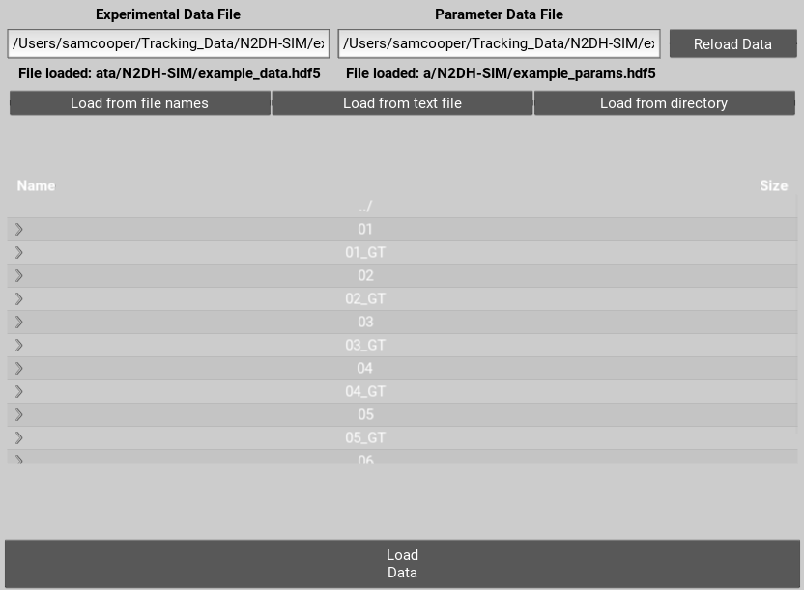

.. nuclitrack documentation master file, created by
   sphinx-quickstart on Fri Feb  3 11:42:43 2017.
   You can adapt this file completely to your liking, but it should at least
   contain the root `toctree` directive.

Getting started
===============

NucliTrack is designed as an easy to use Application for tracking cell nuclei. We're glad you have chosen to try our software out, please follow the following steps to track your first video.

Alternativley check out the `online video guides <https://www.youtube.com/watch?v=J6e0D9F-qSU>`_.

Installation
------------

To get started with NucliTrack we have prebuilt versions available for OSX, Linux (EL7) and Windows:

+-----------------------------------------------------------------------------------------------+------------------------------------------------------------------------------------------------+--------------------------------------------------------------------------------------------+
| .. image:: nt_linux.png                                                                       | .. image:: nt_mac.png                                                                          | .. image:: nt_windows.png                                                                  |
|   :target: https://github.com/samocooper/nuclitrack/releases/download/1.2.0/nuclitrack.tar.gz |   :target: https://github.com/samocooper/nuclitrack/releases/download/1.2.0/NucliTrack.app.zip |   :target: https://github.com/samocooper/nuclitrack/releases/download/1.2.0/NucliTrack.zip |
+-----------------------------------------------------------------------------------------------+------------------------------------------------------------------------------------------------+--------------------------------------------------------------------------------------------+
                                                                                                          
No installation is required for the Application, though we have encountered some issues with different operating systems and computers:

Windows: Due to multiprocessing and loading issues, we have opted not to compile Nuclitrack into a single file executable. Please unzip the file following download, enter it and then double click NucliTrack.exe from within the file, this will launch a console which will then load NucliTrack.

Mac OSX: error 67062, this is to do with gatekeeper interfering with the terminal launch as the App is not trusted. To solve this error, launch terminal and enter the following command:

	> sudo spctl --master-disable
	
Enter your password on request, then launch the NucliTrack Application which should now work. The App will now be trusted so you can re-enable gatekeeper with the following command, and it will continue to work.

	> sudo spctl --master-enable

OpenGL version is less than 2.0: Update your graphics drivers.

NucliTrack is also availale as a Python 3 package for development, and batch processing of image, see the `Python Package Installation`_ section for details of how to install Nuclitrack as a Python package.

Loading time series images
--------------------------

To get started you need a video of cells that need tracking. Importantly, the video must be stored as a sequence of individual single plane tiff files. There are then three options for loading the .tif image time series into NucliTrack.

However, before loading you need to specify file names for the hdf5 files that will store your tracking data and parameters. You can either enter the location for these files directly into the text boxes and hit enter. Alternatively navigate to the desired folder, enter names for the files at the end of the directory path, and then hit enter.

	Select locations to save data on the movie and parameters used.
	

Auto Load
^^^^^^^^^

The autoloading interface allows you to load a .tif series based on the first and last filename of each channel. Whilst it doesn't matter how the rest of the file is named, the image series must contain a continuous series of zero padded time points e.g:

::

   somename_ch1_01.tif
   somename_ch1_02.tif
   somename_ch1_03.tif

   ...

   somename_ch1_99.tif

To load your videos navigate to the folder containing them, select the first image file toggle button and click the first image filename. Click the last image toggle button, and then either modify the filename in the text input bar or select the last image file.

You can now either hit the load images button, or alternativley load another channel as long as the image size and number of frames is the same. To do this choose a different channel from the drop down list, and repeat the above process. Once the first and last file names for all channels have been selected press the load images button:

::

   somename_ch2_01.tif
   somename_ch2_02.tif
   somename_ch2_03.tif

   ...

   somename_ch2_99.tif
   
Finally you can also load a series of uniquely labelled images, where the use of external segmentation software is desired. Specifically, the label series must be the same length and dimensions as the image series, and within each labelled image, each segment must be uniquely labelled. Select the label option form the channel drop down button and then the first and last image in the label series to load the images in.

Load from text
^^^^^^^^^^^^^^

Loading from text is perhaps the easiest way of loading multichannel images, and also is used by batch mode. Load from text requires you to create a text/csv file in which each image filename is specified relative to the text file in order. To specify multiple channels indicate the channel first then the file name seperated by a comma; set the channel to 0 to load in labels. For example where images are in a subdirectory 'ims' the text file would need to be formatted as follows:

::

   1, ims/somename_ch1_01.tif
   1, ims/somename_ch1_02.tif

   ...

   1, ims/somename_ch1_98.tif
   1, ims/somename_ch2_99.tif
   2, ims/somename_ch2_01.tif
   2, ims/somename_ch2_02.tif

   ...
   
   2, ims/somename_ch2_98.tif
   2, ims/somename_ch2_99.tif
   0, ims/labels_01.tif
   0, ims/labels_02.tif
   
   ...
   
   0, ims/labels_98.tif
   0, ims/labels_99.tif

Once you have created the text file, navigate to it in the file browser and double click to load.

Load from dir
^^^^^^^^^^^^^

This is probably the simplest way of loading an image series but only works where a single channel is used. Here, navigate to the folder conainging a single image series, and double click the first image in the series, this will load all other images in the  directory.

.. figure:: Nt01.jpg

   Step 1: File loading, image of the file loading GUI
   
Segmentation
------------

Now you're ready to segment your imaging series. Segmentation is based on a watershed procedure. All the steps except the last two are designed to identify the center of individual nuclei, in the last two steps the aim is to accurately mask every nuclei.

On the left hand side of the interface you should see a panel of sliders allowing you to segment the image. The best way to find out what they do is to play around, though a more detailed description for each control is below:

*    Clipping threshold: this sets the maximum intensity of the image, anything above this intensity is clipped to this intensity
*    Background Correction: background intensity variation is corrected by subtracting a really blurred version of the image from the original, this slider controls how blurred this image is.
*    Blurring: prior to thresholding pixel noise must be reduced this slider adjusts how blurred the image used for thresholding is.
*    Threshold level: the slider here controls what level of intensity should be used to define what are nuclei and what is background. Don't worry if nuclei are touching each other at this point.
*    Filter small objects: if there are lots of small objects that have been thresholded but aren't nuclei you can filter them out using this slider
*    Intensity or Distance: the next step is to identify local maximum within the thresholded regions, ideally local maximum will exist in the center of each nuclei, the maximum intensity often doesn't reflect the center of the nuclei or even worse may lead to multiple local maxima appearing in each cell. This function allows you to choose to what degree local maxima are defined by the intensity or distance from edge.
*    Peak local maxima: behind this slider is a function which identifies local intensity peaks in the image, the slider sets the minimum distance allowed between peaks.
*    Edge detection: this slider controls how blurry the image is prior to edges being marked, more blurry means edges are smoother though may match the shape less.
*    Watershed: behind this slider is the watershed function which calculates where the local basins of attraction are in the image, like marking valleys in a mountainous terrain. The selected peak local maxima represent the bottom of the valleys, by adjusting the slider the lowest area is made larger or smaller, this like mining into the side of mountains to force the valley to be larger.

Use the slider in the top left hand corner to navigate around the video and try out your segmentation parameters on other frames. Also other channels can be selected for segmentaton using the dropdown list in the top right corner, also cell touching the border can be filtered out by selecting the filter edges toggle button.

Once you have achieved good segmentation it's now time to save the parameters. Once this is done, click segment movie to apply your segmentation parameters to the entire image sequence. This may take a while depending on how fast your computer is and how large you movie is.

To speed up the process you can opt to use multiprocessing. However, due to the workload on the CPUs, the GUI does not display a loading bar during this process.

When segmentation is done a button will appear allowing you to visualise the results of segmentation and decide whether you want to go back and adjust parameters or move forward. If you are happy go ahead and click extract features.

You can also export the label files at this point as single plane tifs. To do this create and empty directory by entering a name in the choose directory name text box and hitting enter. Re-enter the current folder and to see this directory then enter the directory and choose an output name for the label series. Hit enter and the series of labelled image will be saved.

.. figure:: Nt02.jpg
   :scale: 80 %
   :alt: Semgentation

   Step 2: Choosing segmentation parameters, image of the segmentation GUI

Training Data
-------------

The algorithm that tracks your cells is probabilistic. Meaning, it will assign a probability to every segment giving it a measure of whether it is likely to be a single nuclei, a mitotic nuclei, on that has left mitosis recently, or an erroneous segmentation either, more than one nuclei or no nuclei.

To calculate the probabilities features must be extracted from each segment. Click extract features to do this, again this step may take a few minutes.

Now select the training data button, you will be presented with a window showing your segmented cells in gray.

The dropdown button in the top right corenr allows you to select a training data class for the probabilistic tracking algorithm. Choose a class then start clicking on the gray nuclei in the field of view. You probably want to select around 10 to 20 examples of single cells, and then 3 or 4 mitotic cells and 5 or 6 cells that have left mitosis.

If allot of segmentation errors have been made consider selecting examples of these, but the algorithm usually works just fine without these examples.

Three new sliders also exist in the top left hand corner along with text, generally the default values will work though you may want to adjust these if tracking is particularly slow:

* The furthest left of these sliders determines how far (in pixels) the algorithm will search in the previous frame, this should roughly correspond to the largest jump that nuclei are making between frames, however larger values will also mean tracking will take longer.
* The middle of the three sliders determines the largest gap between frames that can occur in a track. Smaller values speed up tracking whilst larger values take longer.
* The final slider changes the penalty for movement distance, smaller values mean less penalty than larger values. Reduce this if cells are moving allot whilst increase this value if cells make small movements.

Once everything is selected, click save training. A button for classifying cells will now appear. Click this to assign probabilities to every cell in the image sequence.

Everything is now ready for tracking, hit this button to begin tracking. 

.. figure:: Nt03.jpg
   :scale: 80 %
   :alt: Semgentation

   Step 3: Selecting training data, image of the training data selection GUI

Correcting and storing tracks
-----------------------------

With tracking complete you can now inspect the results of automated tracking by scrolling backwards and forwards through the video. For single frame movements you can also use the keyboard hotkeys (a) and (d).

To inspect data on a track click the select track button, or use the hotkey (z). Then select a labelled cell in the track segment window. Data on this track will now appear in the bottom window. You can jump from one frame to another in the movie, by clicking the jump button or pressing (w), then clicking on the graph. The tracking window will then jump to the frame as selected on the x axis.

Automated tracking is likely to make errors. Buttons on the left hand side let you correct these.

* To add a segment to a track, click add segment (c) then select a segment on the screen.
* To remove a segment click remove segment (v) then select a labelled segment on the screen.
* To swap two tracks over in all proceeding frames, with a track selected, select swap tracks (x) then select another track on the screen.
* To add a new track, select new track (n) then choose an unlabelled segment on the screen.

If you want to export data on all the track click save all to CSV. Otherwise you can select individual tracks and export only these selections. To do this with a track selected click store track. It should now be marked with a black dot. Once you have selected all the tracks you want, then click export selected to csv.

Events can also be added. These are extremely useful if you want to computationally syncronise your cells to specific timepoints such as S-phase entry. There are three event options that you can choose. If you select one of these and then click on the graph window at the desired timepoint, you will see a Cyan, Yellow or Magenta line appear at this point marking the event. When you export your results to csv format, the final column will then contain the number (1, 2 or 3 depending on which event was chosen) at this time point.

You can also change which features you want to visualise using the text boxes on the right. Here choose a number between one and 11, representing the features, the 'Floored Mean' feature is particularly useful for identifying PCNA foci a common fluoresecent label used to mark S-phase in cycling cells:

* Area,
* Eccentricity
* Solidity
* Perimeter
* CH1 Mean Intensity
* CH1 StdDev Intensity
* CH1 Floored Mean
* CH2 Mean Intensity
* CH2 Floored Mean
* CH2 StdDev Intensity
* CH3 Mean Intensity
* CH3 StdDev Intensity
* CH3 Floored Mean

.. figure:: Nt04.jpg
   :scale: 80 %
   :alt: Semgentation

   Step 4: Visualise and correct and export tacking data, image of the tracking visualisation and correction GUI
   
   
.. _Python:

Python Package Installation
----------------------------

If your looking to develop your own features, tracks hundreds of videos in batch, or contribute to the nuclitrack project you will need,  `Python3 <https://www.python.org/downloads/>`_ . We recommend using the `Anaconda <https://www.continuum.io/downloads>`_ distribution for Windows users.

Once you've got Python3 up and running you will need packages called Cython and Numpy (Anaconda already has them installed). These are easily installed using the pip installer, from the terminal type:
::
	> pip install cython
	> pip install numpy

Now you're ready to install NucliTrack:
::
	> pip install nuclitrack

Notes:

*  On windows you will likely need to install kivy prior to nuclitrack, a guide for this can be found on the `kivy website <https://kivy.org/docs/installation/installation-windows.html>`_ . 

From experience after installing the dependencies download the latest wheel e.g. "python3.6, 64bit" from the kivy website then run the following commands:
::
	> python -m pip install C:\Kivy-1.9.1.dev-cp27-none-win_amd64.whl
	
Here substitute in the location of the downloaded .whl file.
	
* If Python2 is installed on your system, you will probably need to specify the pip installer to use e.g. pip3.6, to ensure everything works properly.

On more basic systems some dependencies may cause issues, on RHEL/Fedora linux I have noted a few:

* RHEL/Fedora linux: Kivy may require the openGL dev library to install properly > yum install mesa-libGL 
* RHEL/Fedora linux: Kivy may require xclip/xsel to import properly, install EPEL, then > yum install xclip,xsel
* RHEL/Fedora linux: Kivy may require bzip to to import properly > yum install  bzip2-devel then configure and make python3.6 again

Python Package Functions
------------------------

The python NucliTrack package contains two functions that allow it to be run either as a GUI or in batch mode (discussed later).  In both cases, asserting that the script is being called as main is vital for multithreading to work properly.

To run nuclitrack using the GUI create a new python script, cut and paste the following code into it, and then run the script:

.. code-block:: python

	import nuclitrack
	if __name__=='__main__':
    		nuclitrack.main.run()

To run nuclitrack in batch mode which doesn't require the kivy library, create a new python script and paste the following into it.

.. code-block:: python

	import nuclitrack
	if __name__=='__main__':
    		nuclitrack.batchanalyse.batchanalyse('myfile.txt','myparams.hdf5','myoutput')
		
Here, 'myfile.txt' represents a text file for loading images, in the format described in the `Load from text`_ section. The 'myparams.hdf5' file must be created by using the GUI on a reference movie, and contains the parameters selected for segmentation and tracking, as well as training data chosen in the training data GUI. Finally 'myoutput' is the name that both the 'output.hdf5' and 'output.csv' file will be saved as. The 'output.hdf5' file can then be loaded into the GUI and track correction and inspection carried out. Alternativley results can be directly analysed from the 'output.csv' file. 

To process multiple movies, the batchanalyse function can be called inside a loop where multiple text files are used to index different image series, with the output file name varied accordingly.

Contribute
----------

- Source Code: https://github.com/samocooper/nuclitrack

Support
-------

If you are having issues, please let me know my email is sam^socooper.com sub in the @ for ^.
Also check out my website `socooper.com <http://socooper.com>`_

License
-------

The project is licensed under the MIT license.

